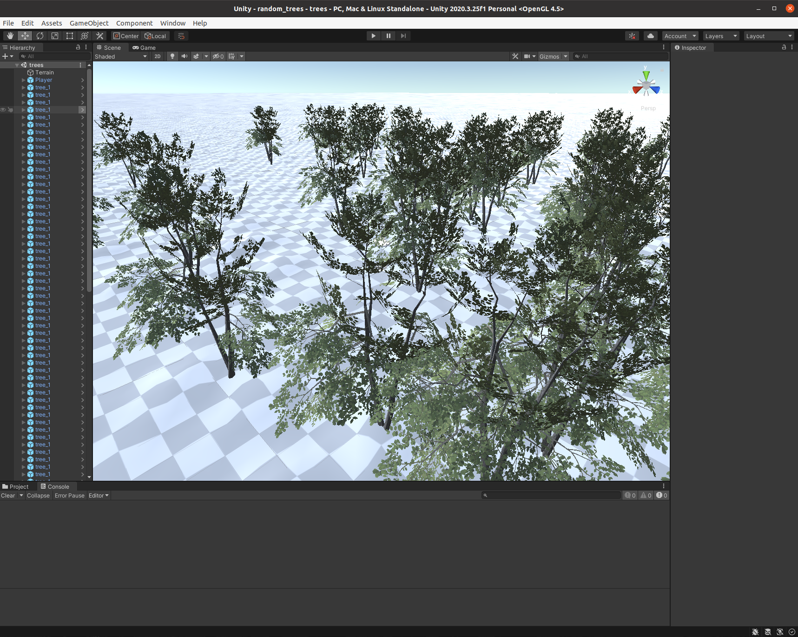

```{r, include = FALSE}
knitr::opts_chunk$set(
  collapse = TRUE,
  comment = "#>"
)
```

This document aims to provide a quickstart guide to using unifir. 
By that, I mean on how an end user could use unifir to produce and create
Unity scenes. For more information on how the underlying framework functions,
check out [unifir 102 - A developer's guide](unifir-dev-guide.html). 
This vignette is going to assume you
want to use unifir directly to control your scenes and manage a Unity project.

But before we get into that, we should answer a question: why use unifir at all?

## Why unifir?

[Unity](https://unity.com/) is a video game engine which can be used to produce
any number of immersive experiences, ranging from fantastical video game worlds
to more grounded representations of real-world places. Typically, a Unity 
project is created and edited entirely in the Unity GUI, with the landscape
and everything in it placed very intentionally by a designer.

That approach works really well when attempting to build artistic experiences,
but limits the power of this tool as a way to represent very specific scenarios.
If you have a landscape you want to represent in a game engine -- be it a
real world location or the outputs from a simulation program -- actually 
creating that representation is a painstaking manual process. And that's a 
shame, because the sorts of immersive virtual environments that you can make in
Unity have the potential to be really powerful communication tools.

It's into that world that we're launching unifir. This package aims to connect
R -- one of the best tools in existence for wrangling data, be it about the real
world or a simulated output -- with Unity, so that creating data-driven 
representations can be less painful (and as a nice side effect, more 
reproducible and less error-prone as well). Hopefully, by providing a 
well-structured set of tools for interacting with the Unity scripting API, we
can make it easier to produce these sorts of data-driven virtual environments
moving forward.

## How unifir?

With the why answered, it's time to move on to the how. Before we get into the
R specifics, it's probably worthwhile to define a few terms.

We'll be talking a lot about Unity _projects_, which are single directories 
inside which all of the code and data associated with a single Unity environment
are stored. unifir operates on a single project at a time; there's not a way to
have a single pipeline work across two different projects. Similarly, a given
Unity GUI window only operates on a single project at a time.
The next level of organization within Unity is a _scene_, which is a collection
of objects and code that are present in the user's environment at the same time.
unifir can operate on multiple _scenes_ within a single _project_ with no 
problem. 

With that sorted, we can move on to unifir itself.
The first part of working with Unity from R is [installing Unity](https://unity.com/download).
Once Unity is installed on your machine, you should be able to locate it using 
the function `find_unity()`:

```{r eval = FALSE}
library(unifir)
find_unity()
```

This function finds the path to the Unity executable on your system that unifir
will use to execute all its commands. Should you want to use a different Unity
version, you can set the environment variable `unifir_unity_path` (or the option
of the same name) to the path to the version you want to use.

With your Unity location set, you should be ready to start working with unifir.
The key object of the unifir package is the "script" object, which unifir uses
to store all of the commands you're going to execute in Unity before actually
running them. We can use the `make_script()` function to make a script, using 
the `project` argument to specify where on our machine we want the Unity project
to exist. If the project directory doesn't exist, it will be created 
automatically unless you set `initialize_project = FALSE`.

```{r eval = FALSE}
script <- make_script(
  project = file.path(tempdir(), "unifir")
)
```

Our object `script` is now an R6 object of the class `unifir_script`. By itself,
this object isn't super exciting; however, it provides the basic shell we're 
going to use to keep track of all the things we want to do to our project.

In order to specify those things, we can go ahead and add "props" to our 
"script" object. unifir comes with a number of prop-building functions 
pre-specified, though the hope is that with time other packages can add their
own props to this framework, enabling a wider variety of functionality than is
currently implemented. For instance, the 
[terrainr](https://github.com/ropensci/terrainr) package provides a function,
`make_unity` (currently only in the development build) 
which converts any files that can be read by the `raster` package into 
terrain surfaces you can actually walk across.
That function wraps a number of unifir props to actually interact with the Unity
engine, but also performs some spatial data wrangling that make sense to live in
a more specialized package.

As a result, the props that are actually implemented in unifir tend to be a 
little more elemental -- creating and saving scenes, adding lights and player
controllers, the sorts of things that are applicable to most Unity projects.
If we wanted to add a character controller to our scene, for instance, we
can use the `add_default_player()` function to modify our `script`:

```{r eval = FALSE}
script <- add_default_player(script)
```

On the surface, our `script` object doesn't change when we do this. However,
if we look at `script$props` instead, we'd see that we now have three 
`unifir_prop` objects in our script. This list is how unifir keeps track of what
exactly it needs to do to make your script into a scene; it will run through 
your props in the order you added them to the script.
`add_default_player()` is just one function that adds props to our script; 
other functions in unifir will add props to add lights, 3D models, terrain,
and more to your script. You can see the prop functions listed under "See Also" 
in any prop's help page (so for instance, after running `?add_default_player`).

One thing to highlight is that we need to explicitly save our scenes at the end
of any script. If you don't save your scene, then after your script executes
you'll find that Unity hasn't made any changes to your project! Always be sure
to add a `save_scene()` call to the end of your script:

```{r eval = FALSE}
script <- save_scene(script)
```

This will save our scene with all of its changes, but Unity won't automatically 
default to _loading_ this scene when we open our project. If we want our scene
to load as soon as we open the project, we can add another prop to our script
via the function `set_active_scene()`:

```{r eval=FALSE}
script <- set_active_scene(script)
```

If you forget to do this, you can open scenes from inside Unity
(File -> Open Scene); unifir always saves scenes to the "Scenes" folder.

Now that we've added props to our script, it's time to actually make our
scene a reality. You can play out your script using the function `action()`,
which will create a Unity project, turn your props into C# code, and then 
execute that code inside the project to produce your scenes!

```{r eval = FALSE}
action(script)
```

And just like that, you've created a Unity project that you can open and look
around in! Note that your scene won't be open by default (unless you've used
the `set_active_scene()` function) -- to actually _see_ all the changes you've
made, make sure to load the scene located in the `Scenes` folder inside your
project.

## A full example

So now that we know the basics of how a unifir script is built, we should walk
through how to actually build one to make a scene! We'll walk through adding
terrain, trees, and a character to a scene and then see what it looks like when
rendered.

First things first, we'll need a script! Just like before, we'll make our script
using the `make_script()` function:

```{r eval = FALSE}
tree_script <- make_script(
  project = file.path(tempdir(), "unifir", "random_trees")
)
```

Up next, we need data on the terrain we want to add! We can generate
a random terrain surface using the terra package, so we'll load that now:

```{r eval = FALSE}
library(terra)
```

And we'll need to convert that terrain into a format Unity can read, so we'll
load in the terrainr package as well:

```{r eval = FALSE}
library(terrainr)
```

Importing terrain into Unity is a little bit wonky. First off, Unity can't
process standard raster data, but rather needs a specialized format that
most libraries don't work with; for that reason, we're going to need to use
terrainr's `transform_elevation()` function to transform our elevation raster 
into a proper format.

Additionally, Unity doesn't have a great way for wrangling objects of different
unit systems -- it assumes that a distance of "1" in a 3D model is also a
distance of "1" in the terrain, no matter what units that "1" is in.
It's common, but not at all universal, for a distance of "1" to represent a 
distance of 1 meter, but depending where you're getting assets from you might
need to rescale your rasters and models to make everything line up 
appropriately.

Lastly, Unity expects terrain tiles to be (2^x) + 1 unit squares, where x is
some number between 1 and 12. For that reason, we'll go ahead and generate a 
terrain tile that's 4,097 units across in both directions, with heights
centered on 10 units elevation.
We'll then go ahead and write that out to a temporary file at 
`raster_file`, then use terrainr to convert that raster into a format Unity
can import:

```{r eval = FALSE}
terrain_size <- 4097
r <- terra::rast(
  matrix(rnorm(terrain_size^2, 0, 0.2), terrain_size),
  extent = terra::ext(0, terrain_size, 0, terrain_size)
)

raster_file <- tempfile(fileext = ".tiff")
terra::writeRaster(r, raster_file)

# I'm quieting the warnings down here, because they can be safely ignored:
raster_file <- suppressWarnings(
  terrainr::transform_elevation(raster_file, 
                                side_length = terrain_size,
                                output_prefix = tempfile())
)
```

We can then go ahead and add that terrain object to our scene using the 
function `create_terrain()`. This function is a bit unwieldy 
(and will soon have some user-friendly wrappers in the terrainr package),
so I'll explain the function arguments inline:

```{r eval = FALSE}
tree_script <- create_terrain(
  script = tree_script, # Our unifir_script
  heightmap_path = raster_file, # The file path to our elevation raster
  # Where should the "top-left" corner of the terrain sit? 
  # Note that Unity uses a left-handed Y-up coordinate system 
  # where Y is the vertical axis and X and Z define the "horizontal" plane.
  # We want our terrain to center on the origin of the scene (that is, 0,0,0)
  # so we'll set both to -2,050:
  x_pos = -2050,
  z_pos = -2050,
  width = terrain_size, # The total width of the terrain tile (X axis)
  length = terrain_size, # The total length of the terrain tile (Z axis)
  height = as.numeric(terra::global(r, max)), # Max height of the terrain (Y axis)
  # How many pixels are there in the raster along the total width/length?
  heightmap_resolution = terrain_size 
)
```

Our terrain is now set to be added to our scene when we run our script! 
Up next, we can go ahead and add trees on top of the scene. 
We'll randomly generate 100 X and Z coordinates (since Y is "up" in Unity),
centered around the 0,0 point at the middle of our map:

```{r, eval = FALSE}
num_trees <- 100
pos <- data.frame(
  x = runif(num_trees, -40, 40),
  z = runif(num_trees, -40, 40)
)
```

Planting trees at these positions is a lot easier than putting our terrain in 
place. unifir provides a function, `add_default_tree()`, which will download
and add a few simple tree models to any scene you want. There's 12 tree
models available at the time of writing, all released under the public domain; 
we'll use the first one named `tree_1`.

This function is vectorized, so can create multiple trees at once. We'll take
advantage of that by providing our X and Z coordinates to create 100
separate trees at once -- note that if we wanted, we could also pass a vector
of tree names to use multiple models at the same time. 

```{r eval=FALSE}
tree_script <- add_default_tree(
  tree_script,
  "tree_1",
  x_position = pos$x,
  z_position = pos$z,
  y_position = 0 # The average height of the terrain
)
```

We've now got instructions to create our terrain and our tree objects! We 
also want to add a player controller to the scene, using the 
`add_default_player()` function created earlier:

```{r eval=FALSE}
tree_script <- add_default_player(tree_script)
```

And we should also add a light to the scene, using the `add_light()` function:

```{r eval=FALSE}
tree_script <- add_light(tree_script)
```

With all of our props in place, we now need to make sure that we save our
changes! We should also set up our project so that it loads our scene as soon
as its opened:

```{r eval=FALSE}
tree_script <- tree_script |>
  save_scene(scene_name = "trees") |>
  set_active_scene(scene_name = "trees")
```

And with that, we're good to go! The only thing left to do is to run our script,
using the `action()` function:

```{r eval=FALSE}
action(tree_script)
```

Upon opening Unity, you should see your terrain and trees fully realized in the
scene:

```{r echo=FALSE}

```

If you hit the "play" button at the top of the window, you'll drop into the 
player character and can walk around and explore your environment.

And there's all you need to know to start using unifir! If you're looking to get
even more in the weeds about how unifir works, make sure to check out
unifir 102 - A developer's guide.
